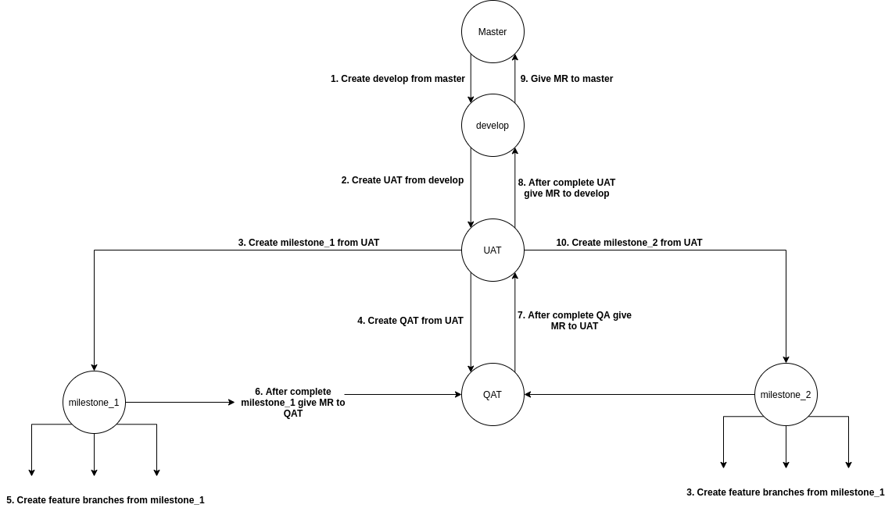

## Git Branching structure

This is a Git branching diagram for waterfall model

### Naming Conventions
We have to follow below naming convention for branch name.

* `< service-name > / < type > / < task-name > `
	* `service` : any service name like `Customer`, `Product`, `Admin` etc.
    * `type `
        * feature : A new feature.
        * bugs  : Code changes linked to a known issue.
        * client-feedbacks : client feedback after UAT deployment/completion
        * hotfix  : Quick fixes to the codebase.
        * junk : Experiments (will never be merged).
    * `name` : name of branch like `setup-login-api`

### Milestone 1

1. Create `develop` branch from `master` branch.
2. Create `UAT` branch from `develop` branch.
3. Create `milestone_1` branch from `UAT` for milestone 1 tasks.
4. Now all branches for milestone 1 are created from `milestone_1` branch and push to `milestone_1` branch after code review.
5. After completion of Milestone 1. A new branch `QAT` is created from `UAT` for QAT of project.
6. A Merge Request is given to `QAT` from `milestone_1`.
8. After successful QAT For client we will deploy code to `UAT`. 

### Milestone 2

1. Create a `milestone_2` branch  from `UAT`
2. All Milestone 2 task branch will be created from `milestone_2`.
3. After completion of Milestone 2 a Merge Request is given to `QAT` from `milestone_2`.
4. After successful QAT For client we will deploy code to `UAT`.

### Client Feedback
1. For all client feedback branch will be created from respective milestone branch. Like if Milestone 1 feedback is given by client then we will create a resolve feedback branch from `milestone_1` branch.